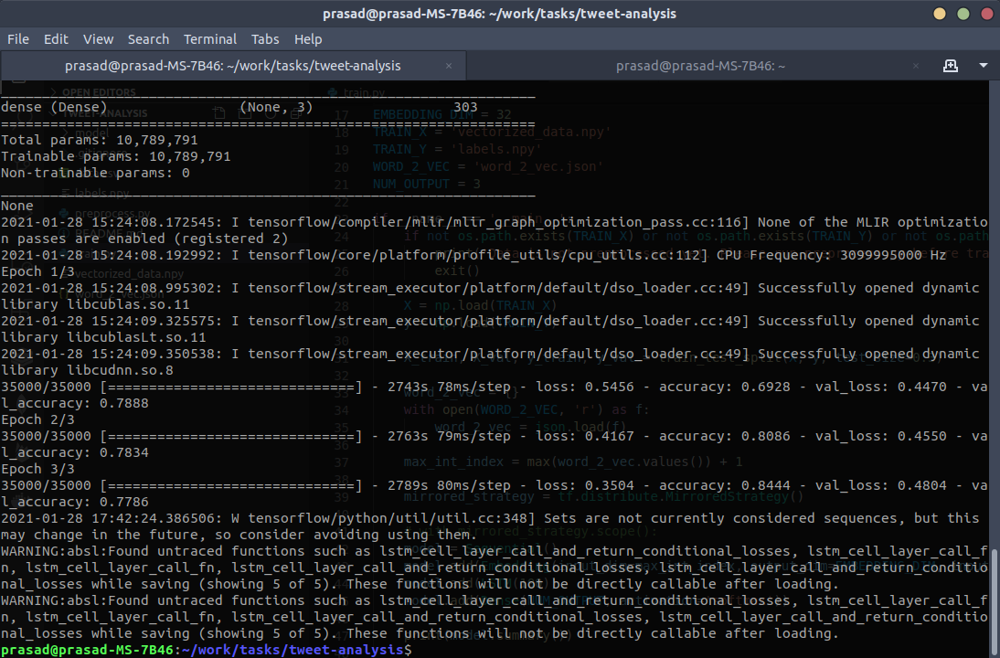

# Tweet Analysis

## Dataset:
[Sentiment140 dataset with 1.6 million tweets](https://www.kaggle.com/kazanova/sentiment140) 
### Content:
It contains the following 6 fields:

1. target: the polarity of the tweet (0 = negative, 2 = neutral, 4 = positive)
2. ids: The id of the tweet ( 2087)
3. date: the date of the tweet (Sat May 16 23:58:44 UTC 2009)
4. flag: The query (lyx). If there is no query, then this value is NO_QUERY.
5. user: the user that tweeted (robotickilldozr)
6. text: the text of the tweet (Lyx is cool)

## Model:
1. What is the model preferred to do classification ?
This is a simple LSTM based netowrk which has an `Embedding` layer at the beginning, followed by the `LSTM` cell and a `Dense` layer which serves as output layer.

2. Why was it chosen?
Since, `LSTM`s are efficient in learning order dependencies, it is perfectly suited for tasks like text analysis where the overall context of the text depends on the arrangements of the words within it.

3. What are other alternatives?
Other alternatives can be a `BERT` model or using `GRU`s instead of `LSTM`s in the same architecture or building a completely new network using any combinations of `GRU`s, `LSTM`s or `SimpleRNN`s.

## Performance:
1. What are the metrics used to evaluate the model classification?
Accuracy & validation accuracy

2. Quantitatively explain the performance of the model.

## Improvements:
1. How can the model be improved further?
There are multiple permutations and combinations which can be applied to improve the performace of this mode. e.g. Adding more `Dense` layers with `Relu` activations, changing the dimension of the `Embedding` layer, etc.   
Not very well versed with `Transformer` cell but since `BERT` models use `Transformer` cells which outperform any `LSTM` based networks, I believe a `BERT` model can excel at this task.

## Dependencies:
1. Python v3
2. Tensorflow v2.2
3. tqdm
4. scikit-learn

## How to train the model?
1. Download the dataset from the above link.
2. Run the preprocessing script; `python3 preprocess.py`
3. Then you can start training by executing `python3 train.py`